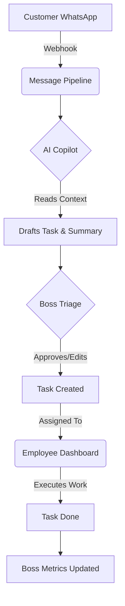
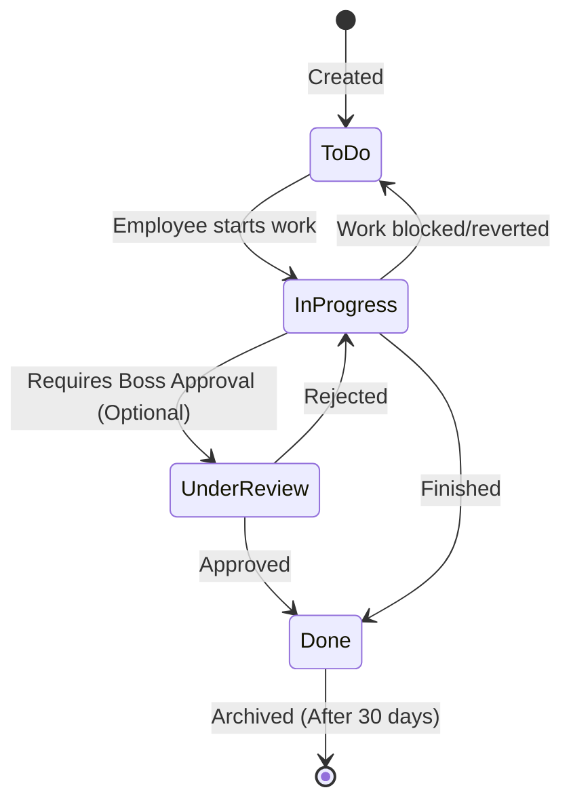
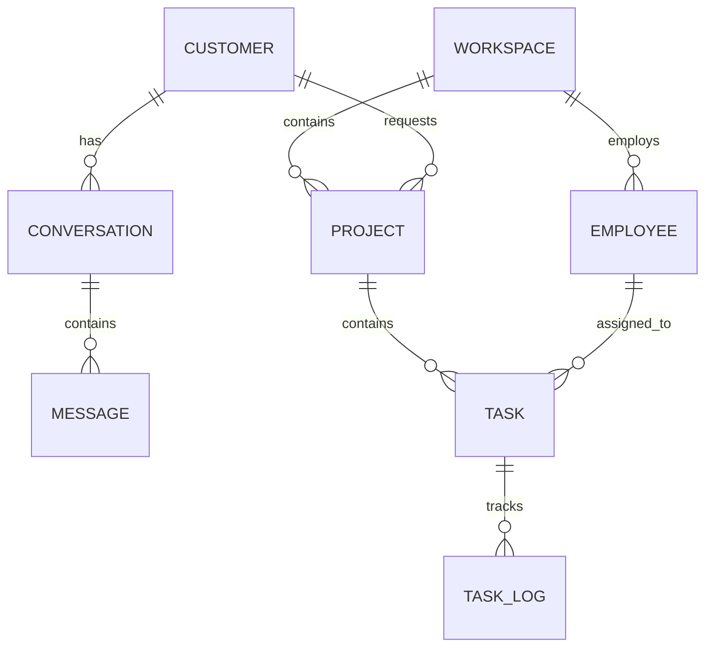
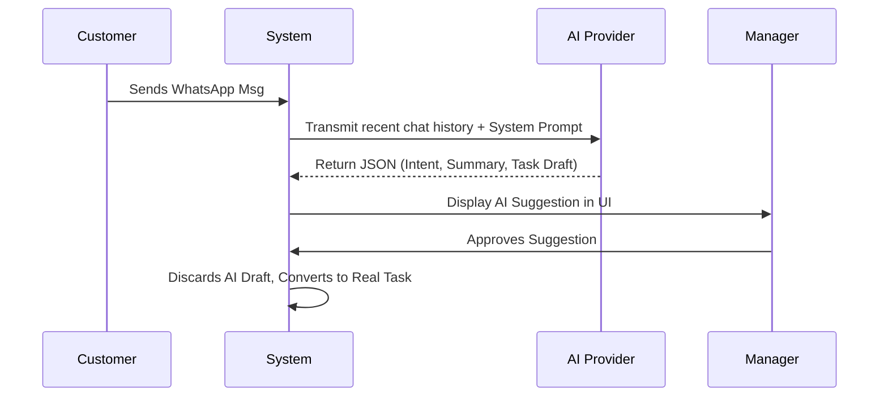
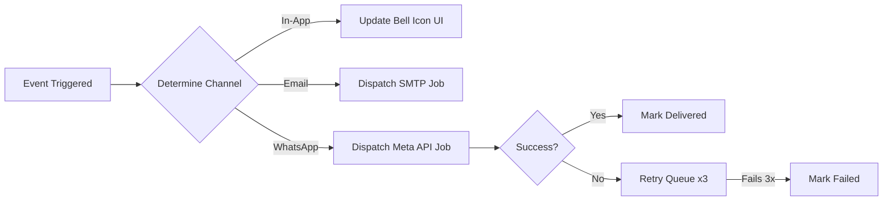

# 17. Appendix

This appendix provides visual diagrams mapping the core workflows and relationships within THE-SPACE-MANAGEMENT.

## 1. Core Workflow Pipeline

## 2. Task Lifecycle (Kanban)

## 3. Database High-Level Relationships

## 4. AI Prompting Architecture

## 5. Notification Flow

