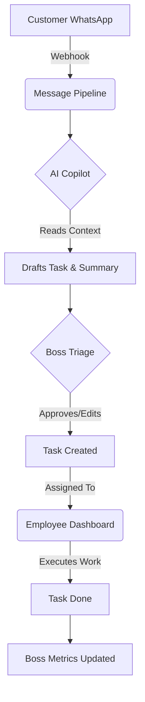
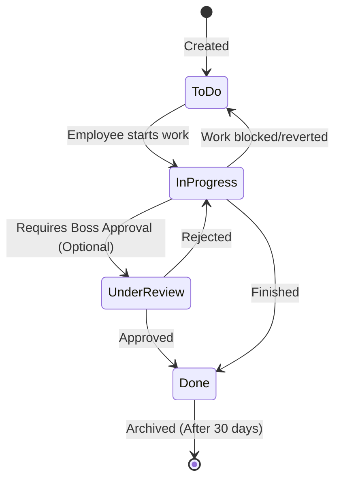
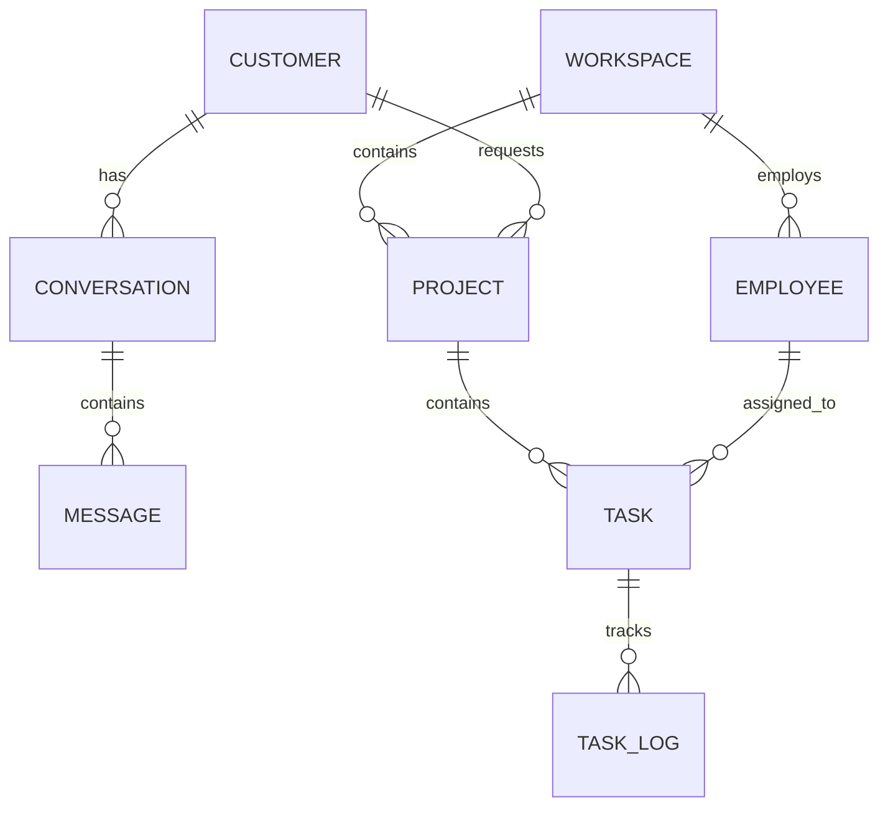
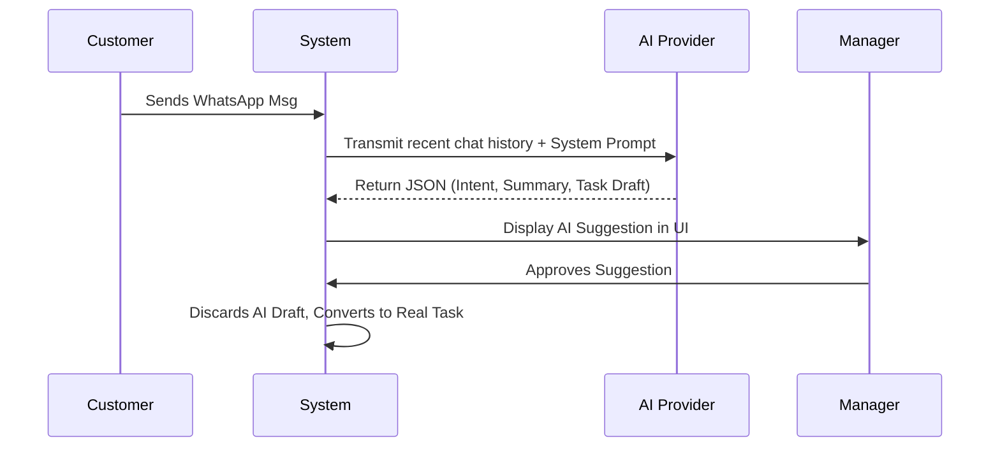
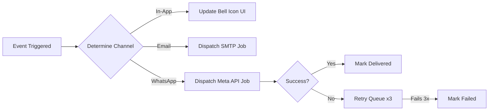

# 01. Introduction

Welcome to THE-SPACE-MANAGEMENT, an advanced, AI-assisted platform designed to streamline operations, project management, and customer communication. 

## What THE-SPACE-MANAGEMENT Is
THE-SPACE-MANAGEMENT is a centralized Work OS (Operating System) that bridges the gap between customer communication (via WhatsApp) and internal operational execution. It is designed specifically for service-oriented teams, clinics, and agencies that need to track incoming requests, triage issues efficiently, and manage ongoing projects without losing critical context.

## Problems It Solves
- **Lost Customer Context:** Instead of having customer issues buried in isolated WhatsApp chats, every message is tied directly to their CRM profile and any resulting tasks.
- **Triage Bottlenecks:** Manual ticket triage is slow. Our system uses Artificial Intelligence to instantly read incoming messages, summarize the core issue, and even suggest the correct task assignments.
- **Scattered Workflows:** Replaces disjointed tools (spreadsheets, separate task managers, and messaging apps) with one unified command center.

## Core Philosophy
We believe that technology should serve as a co-pilot, not just a database. 
- **Data is Connected:** A task is never just a task; it is linked to a project, a customer, and a conversation.
- **AI is an Assistant, Not a Replacement:** The system suggests, but humans approve. You remain in complete control.
- **Frictionless Action:** Every screen is designed for speed. If you need to search for something, the Global Command Palette gets you there in one keystroke.

## AI-Assisted Workflow
When a customer sends a message to your organization:
1. **AI Ingestion:** The AI immediately reads the message.
2. **Analysis:** It extracts the intent, summarizes the problem, and determines urgency.
3. **Drafting:** It automatically drafts a task (e.g., "Fix Printer at Clinic A").
4. **Approval:** A manager (Boss) reviews the suggestion, approves it with one click, and the system assigns it to the best available employee.

> [!TIP]
> You do not have to use AI for everything. You can always manually create tasks and route conversations if you prefer total manual control.

## System Architecture Overview
The platform is broken down into four distinct "Hubs":
1. **Conversation Center:** The unified inbox for all external communications.
2. **Task Platform (Kanban):** The execution engine where Employees actually do the work.
3. **Project Management:** The macro-level view of long-term goals and milestones.
4. **Customer CRM:** The repository of all customer relationships and historical data.

## Main User Roles
The platform respects strict access controls based on three main roles:

1. **Administrator (SysAdmin):** Handles the configuration of the system. Manages integrations (WhatsApp, AI), system health, global settings, and user provisioning.
2. **Boss (Manager):** The orchestrator. Bosses receive customer issues, review AI suggestions, assign work, monitor project health, and review analytics.
3. **Employee (Technician/Agent):** The executor. Employees log in, view their assigned tasks on their personal dashboard, execute the work, communicate with customers, and mark tasks as done.

## Typical Daily Workflow
A standard day in the system looks like this:
- **08:00 AM:** A Customer sends a WhatsApp message reporting a broken machine.
- **08:01 AM:** The AI Pipeline processes the message and queues a drafted Task.
- **08:15 AM:** The Boss logs in, reviews the drafted Task, adds a "Boss Note", and assigns it to an Employee.
- **08:30 AM:** The Employee opens their dashboard, sees the new Task, drags it to "In Progress", and travels to the site.
- **10:00 AM:** The Employee fixes the machine, takes a photo, uploads it as an attachment, and marks the Task as "Done".
- **10:05 AM:** The system automatically logs the resolution time, updating the Boss's velocity metrics on the Reports Dashboard.

[Screenshot: High-Level Dashboard Overview]
# 02. Getting Started

This guide will walk you through your first time logging into the platform, navigating the interface, and mastering the basic productivity tools available to every user.

## Logging In
1. Navigate to the platform URL provided by your Administrator.
2. Enter your Email Address and Password.
3. Click **Sign In**.

> [!WARNING]
> If you forgot your password, contact your Administrator. For security reasons, automated password resets may be disabled depending on your company's security policies.

## First Workspace Setup
If you are the first user (Admin) logging into a fresh installation, you will be prompted to create your first **Workspace**. 
- A Workspace represents a distinct business unit, department, or company branch.
- You must create at least one Workspace before you can invite Employees or create Projects.

## Dashboard Overview
Once logged in, you will land on your default Dashboard. The contents of this dashboard depend entirely on your Role:
- **Administrators:** See System Health, Server Metrics, and recent Error Logs.
- **Bosses:** See Executive Analytics, Task Velocity, and AI Triage Queues.
- **Employees:** See their personal Kanban board, specifically filtered to show only Tasks assigned to them.

[Screenshot: Example Employee Dashboard]

## Navigation
The platform uses a unified sidebar on the left side of the screen.
- **Top Section:** Core operational hubs (Dashboards, Tasks, Conversations).
- **Middle Section:** Management hubs (Projects, CRM, Employees).
- **Bottom Section:** System settings and your personal Profile.

On mobile devices, the sidebar collapses into a "hamburger" menu (three horizontal lines) in the top left corner.

## Profile
Click on your name in the bottom left corner to access your Profile.
Here you can:
- Update your Name and Email.
- Change your Password.
- Configure your personal notification preferences (e.g., mute email alerts).

## Notifications
Look for the **Bell Icon** in the top right corner of the screen.
- A red dot indicates unread notifications.
- Click the bell to open the Notification Drawer.
- Notifications inform you of important events: "You were assigned a new task," "A project is overdue," or "A new WhatsApp message arrived."
- You can mark notifications as read individually or click **Mark all as read**.

## Dark Mode
The platform fully supports Dark Mode to reduce eye strain in low-light environments.
- Click the **Sun/Moon** icon next to the Notification Bell in the top right corner.
- This will instantly toggle the interface between Light Mode and Dark Mode.
- Your preference is saved locally on your device.

## Search
You don't need to click through five menus to find what you're looking for. The platform features a powerful Global Search.
- Click the **Search Bar** at the top of the screen (or use the Command Palette, explained below).
- Type a Customer's name, a Task title, a Project name, or a Phone Number.
- The system will search across all databases simultaneously and provide clickable links directly to the result.

## Command Palette
The Command Palette is the ultimate productivity tool for power users. It allows you to navigate the entire system using only your keyboard.

**How to open it:**
- Press `CMD + K` (Mac) or `CTRL + K` (Windows) from anywhere in the app.

**What you can do:**
- Start typing to search for Customers, Tasks, Projects, or Employees.
- Use the **Up/Down Arrow Keys** to select a result.
- Press **Enter** to instantly navigate to that record.

> [!TIP]
> Master the Command Palette. It is the fastest way to move through the system without touching your mouse.

## Keyboard Shortcuts
In addition to the Command Palette, the system supports various shortcuts to speed up your workflow:
- `CMD + K` / `CTRL + K`: Open Command Palette
- `ESC`: Close any open modal, dialog, or the Command Palette.
- `Click outside`: Clicking outside of a popup window will always safely close it.
# 03. Administrator Guide

As an Administrator (SysAdmin), you hold the keys to the platform. Your role is not to manage daily tasks, but to ensure the system is configured correctly, securely, and is running smoothly.

> [!WARNING]
> With great power comes great responsibility. Actions taken in the Administrator panels can alter the platform's behavior for all users. Proceed with caution.

## Workspace Settings
Workspaces divide your platform into logical business units. 
- Navigate to **Settings > Workspaces**.
- You can create multiple workspaces (e.g., "IT Support", "HR Management").
- Projects and Tasks belong to specific workspaces, allowing you to isolate data between departments.

## Company Information
Maintain your global company profile under **Settings > Company**.
- Upload your company logo (this will reflect in the top left corner of the sidebar).
- Set your primary timezone. (This is critical for accurate SLA and response time calculations).

## Employees, Roles & Permissions
You control who has access to the platform.
- **Adding Employees:** Navigate to **Employee Management**. Create a new user by providing their Name, Email, and Job Title.
- **Roles:** The system uses Role-Based Access Control (RBAC). 
  - `Admin`: Full system access.
  - `Boss`: Management access (Dashboards, Project creation, AI approval).
  - `Employee`: Execution access (Kanban board, specific task assignments).
- **Archiving:** You cannot hard-delete an employee to preserve historical task records. Instead, you **Archive** them, which revokes their login access immediately.

## Projects
While Bosses manage daily projects, Administrators define the global Project parameters.
- Ensure that Projects are mapped correctly to Customers in the CRM.

## AI Configuration
The platform's AI Copilot requires proper configuration.
- **API Keys:** Navigate to **Integrations > AI Settings**. Enter your OpenAI / Anthropic API keys securely.
- **Prompt Engineering:** You can adjust the "System Prompt" that dictates how the AI behaves. If you want the AI to be more formal with customers, or extract specific serial numbers, adjust the prompt here.

## WhatsApp Configuration
Credentials live in server `.env` (not a Settings UI screen today):

- Set `WHATSAPP_PHONE_NUMBER_ID`, `WHATSAPP_ACCESS_TOKEN`, `WHATSAPP_VERIFY_TOKEN`, and `WHATSAPP_APP_SECRET`.
- Point Meta’s webhook at `{APP_URL}/api/v1/webhooks/whatsapp` and subscribe to **messages**.
- Full steps, tunnel, smoke tests, and troubleshooting: [`docs/WHATSAPP_WEBHOOK_SETUP.md`](../WHATSAPP_WEBHOOK_SETUP.md).

If that connection breaks, incoming messages will fail to appear in the Conversation Center.

## Email Configuration
The system sends transactional emails (e.g., "You have been assigned a task").
- Configure your SMTP host, port, username, and password in the **Email Settings**.

## Workflow Configuration & Rules Engine
Workflows dictate the columns on the Kanban board.
- Navigate to **Workflows**.
- You can define custom states (e.g., `To Do`, `In Progress`, `Awaiting Parts`, `Done`).
- **WIP Limits (Work In Progress):** You can set a strict limit on specific columns. For example, setting a WIP limit of `3` on "In Progress" prevents a Boss from assigning a 4th simultaneous task to an Employee, preventing burnout.

## Feature Flags
Testing a new workflow? Use Feature Flags.
- Under **Settings > Feature Flags**, you can toggle specific experimental features on or off globally without requiring a developer to deploy code.

## Health Monitor & Logs
Your primary dashboard includes the **System Status Widget**.
- **Database Status:** Checks if the platform can read/write data.
- **Redis Cache:** Checks if the high-speed queue system is responsive.
- **Application Logs:** View real-time error logs to diagnose issues (e.g., "Failed to send WhatsApp message").

## Backups & System Maintenance
- Database backups run automatically, but you should regularly verify their integrity.
- If a background queue stalls (e.g., tasks are not being assigned by AI), you can monitor queue workers from the server metrics dashboard.

[Screenshot: Administrator Settings Panel]
# 04. Boss Guide

As a Boss (Manager), you are the orchestrator of the platform. You do not typically execute the manual labor; instead, you triage incoming problems, manage projects, assign work to Employees, and monitor performance.

## Receiving Customer Problems
When a customer sends a WhatsApp message, it arrives in the **Conversation Center**.
- Your job is to monitor incoming issues.
- The system highlights unread messages in bold.
- If the AI Pipeline is active, the system may have already drafted a Task based on the customer's message.

## AI Analysis & Approving Task Creation
When a complex issue arrives, the AI Copilot will generate a summary and suggest a Task.
1. Open the conversation.
2. Look at the **AI Summary** panel on the right side of the screen.
3. Review the AI's suggested Task Title and Urgency.
4. If correct, click **Approve & Create Task**. 
5. If incorrect, you can manually override the fields before creating the task.

> [!TIP]
> The AI is designed to save you typing time, but it lacks your managerial intuition. Always verify its suggestions before assigning a critical task.

## Adding Boss Notes
Before assigning a task, you should add context.
- Open the Task details.
- Add a **Boss Note**. This is an internal, private instruction that only Employees can see (Customers never see this). 
- Example: *"Ahmed, please check the fuser unit first, it was replaced last month."*

## Selecting Projects
Tasks should not float aimlessly. They belong to Projects.
- When reviewing a Task, assign it to the appropriate active Project.
- This ensures that the Task's completion contributes to the Project's overall health and velocity metrics.

## Reassigning Work & Monitoring Employees
You control the flow of work.
- Navigate to the **Task Hub**.
- You can view Tasks in a Table or Kanban view.
- To reassign a task, click the assignee dropdown and select a different Employee.
- Use the **WIP (Work in Progress)** metrics to see if an Employee is overloaded. If an Employee has 5 tasks "In Progress", do not assign them a 6th.

## Tracking Progress & Closing Issues
As Employees complete tasks, you will see the statuses change in real-time.
- A Task moving to "Done" automatically logs the completion timestamp.
- Once all Tasks related to a Customer's initial complaint are "Done", you can mark the overarching Issue as **Closed**.

## Reviewing Reports & Dashboards
Data drives good management.
- Navigate to the **Reports Hub**.
- Here you can monitor:
  - **Task Completion Velocity:** A 7-day rolling chart showing how many tasks your team completes daily.
  - **Average Response Time:** How quickly your team moves tasks from "To Do" to "Done".
  - **Employee Performance:** Compare task closures across your workforce.

[Screenshot: Boss Executive Dashboard]
# 05. Employee Guide

As an Employee, the system is designed to keep you focused on execution. You will not see complex executive reports or billing dashboards. Your entire day revolves around your personal Task Dashboard.

## Daily Workflow: Logging In
When you log in, you will land directly on the **Employee Dashboard**.
- This dashboard is automatically filtered to show **only** the Tasks assigned to you.
- You do not need to search for work; your Boss has already queued it up for you.

## Viewing Assigned Tasks & Priorities
Tasks are organized by Priority (Low, Normal, High, Urgent) and Due Date.
- **Red tags** indicate Urgent tasks. Tackle these first.
- Click on any Task card to open the **Task Details** panel.

## Task Details & Customer Context
A Task contains everything you need to solve the problem.
- **Description:** The core problem statement.
- **Boss Notes:** Internal instructions from your manager (e.g., "Check the warranty status first").
- **Linked Conversation:** If this task originated from a WhatsApp message, you will see a link to the exact conversation history.

## Reading Customer Conversations
You can click into the **Conversation Center** to read the exact words the customer sent.
- Understanding the customer's frustration or specific wording can help you diagnose the problem faster.
- Do not reply to the customer unless your company policy explicitly allows technicians to handle direct communication.

## Viewing Attachments
Customers frequently send photos of broken equipment or error screens.
- Open the Conversation Center or the Task Details.
- Click **View Attachment** to see images or PDFs directly in your browser.

## Writing Notes
As you work on a task, you must document your progress.
- Inside the Task Details, use the **Internal Notes** section.
- Write updates like, *"Arrived on site. Diagnosed a faulty power supply. Ordering replacement."*
- These notes are timestamped and visible to your Boss, providing a clear audit trail of your work.

## Uploading Files
If you complete a physical repair, take a photo.
- Use the **Upload Attachment** button in the Task details to attach proof of resolution, signed delivery receipts, or diagnostic logs.

## Completing Tasks & Time Tracking
When the work is done, you must update the system.
1. Drag the Task card from "In Progress" to **Done**.
2. Alternatively, open the Task Details and click **Mark as Complete**.
3. The system automatically records the exact timestamp you completed the task. This data is used to calculate your performance metrics, so always mark tasks done *immediately* after finishing the work.

> [!WARNING]
> Do not move tasks back to "To Do" after marking them "Done". If a problem reoccurs, your Boss will create a new Task.

## Dependencies & Checklists
Some complex tasks contain **Checklists**.
- You must check off every sub-item before the system allows you to mark the main Task as "Done".
- If your task has a **Dependency** (e.g., "Awaiting Parts"), you cannot move it to "In Progress" until the blocking task is completed.

[Screenshot: Employee Personal Kanban Board]
# 06. Conversation Center

The Conversation Center is the unified communications hub. It transforms chaotic WhatsApp threads into structured, actionable tickets.

## The Conversation List
The left side of the screen displays your active conversations.
- Conversations are sorted by the most recent message.
- Unread messages are bolded.
- A small badge indicates how many unread messages are in that thread.

## Filters & Search
You don't have to scroll endlessly to find a specific chat.
- **Search Bar:** Type a Customer's Name, Phone Number, or Email. The list updates instantly (debounced search).
- **Filters:** Toggle between `All`, `Unread`, `Active`, and `Archived` conversations.

## The Message Timeline
Clicking a conversation opens the Timeline in the center of the screen.
- **Green Bubbles:** Outbound messages sent by your team.
- **White Bubbles:** Inbound messages received from the customer.
- Every message includes an exact timestamp.
- The system automatically handles multi-line text and emojis.

## Media & Attachments
Customers frequently send images (e.g., screenshots of errors).
- The system intercepts WhatsApp media attachments securely.
- Inline buttons will appear reading **[View Attachment]**.
- Clicking this opens the image cleanly without downloading malicious files directly to your device.

## AI Summary
On the right side of the screen, you will find the **AI Copilot** panel.
- The AI automatically reads the entire conversation history.
- It generates a 2-3 sentence summary of the core issue.
- This saves you from reading 50 messages of "Hello, are you there?" to find the actual problem.

## Internal Notes
You can leave private notes on a conversation that the customer will never see.
- Useful for handing off a chat to another agent: *"Ahmed, this customer is very angry about a delayed shipment. Please handle."*

## Customer Profile
Also on the right panel is the **Customer Profile**.
- Displays the Customer's Name, Company, Phone Number, and VIP status.
- Shows a list of **Linked Tasks** currently active for this customer, preventing you from opening a duplicate task if one is already being worked on.

## Replying & History
To send a message back via WhatsApp:
1. Type your response in the bottom input bar.
2. Press **Enter** or click **Send**.
3. The message is instantly queued and dispatched via the WhatsApp Cloud API.
4. If a message fails to send (e.g., API timeout), the system will automatically retry 3 times behind the scenes.

> [!NOTE]
> All conversation history is retained indefinitely. You can always search for a customer 6 months later and see their complete interaction history.

[Screenshot: Conversation Center Interface]
# 07. Task Platform

Tasks are the fundamental units of work in THE-SPACE-MANAGEMENT. If a problem isn't captured as a Task, it doesn't exist.

## The Task Lifecycle
A Task moves through a standardized lifecycle defined by your company's Workflow.
1. **Creation:** Generated manually by a Boss or automatically by the AI Pipeline.
2. **Assignment:** Delegated to a specific Employee.
3. **Execution:** Moved to "In Progress" while work occurs.
4. **Completion:** Moved to "Done".

## Statuses & Workflows
Tasks do not have hardcoded statuses like "Open" or "Closed". Instead, they use dynamic **Workflow States**.
- Typical columns: `To Do` ➔ `In Progress` ➔ `Under Review` ➔ `Done`.
- **WIP Limits (Work In Progress):** The system prevents employees from becoming overwhelmed. If the "In Progress" column has a WIP Limit of 3, the system will actively block you from dragging a 4th task into that column.

## Subtasks & Checklists
Complex tasks can be broken down.
- Add a **Checklist** to a task (e.g., "1. Check power. 2. Replace toner. 3. Print test page.").
- Subtasks must be completed before the parent task can be marked Done.

## Dependencies
Tasks can block other tasks.
- If Task B depends on Task A, Task B cannot be moved to "In Progress" until Task A is "Done".

## Watchers & Reviewers
- **Assignee:** The person doing the work.
- **Reviewer:** The Boss who must approve the work before it is finalized.
- **Watchers:** Anyone who wishes to receive notifications when the task is updated.

## Time Tracking
The system handles time tracking automatically.
- It records the exact timestamp when a task is created (`created_at`).
- It records the exact timestamp when a task transitions to the final 'Done' state (`completed_at`).
- The difference between these two timestamps calculates your **Response Time KPIs**.

## Attachments
You can upload files directly to a Task.
- Maximum file size is typically 20MB.
- Supported formats: Images (JPG/PNG), PDFs, and standard Office documents.

## Recurring Tasks
For preventative maintenance or regular audits, you can set a task to recur.
- e.g., "Server Backup Audit" ➔ Recurs every Friday at 9:00 AM.
- The system will automatically spawn a fresh task clone at the specified interval.

## Archive vs. Delete
- You should almost **never** delete a Task. Deleting destroys historical metrics.
- Instead, Tasks are automatically **Archived** once they remain in the "Done" column for a specific duration (e.g., 30 days). Archived tasks remain fully searchable but vanish from active Kanban boards.

## Search & Bulk Actions
- Use the **Global Search** to find any task by its Title or ID (e.g., `TSK-1042`).
- In the Table view, you can select multiple tasks using checkboxes to apply **Bulk Actions** (e.g., Reassign 10 tasks to a new employee simultaneously).

## Views: Kanban, Calendar, Timeline, Table
You are not restricted to one view.
- **Kanban:** Best for daily execution (drag and drop cards).
- **Calendar:** Best for visualizing Due Dates.
- **Timeline (Gantt):** Best for seeing overlapping task durations.
- **Table:** Best for bulk editing and dense data sorting.

[Screenshot: Task Kanban Board]
# 08. Project Management

While Tasks track individual pieces of work, **Projects** track the overarching goal. 

## Projects
A Project acts as a container for related Tasks. 
- Example: "Al Noor Clinic IT Migration" is a Project. "Install Router at Al Noor" is a Task inside that Project.
- Projects are associated with a specific **Customer**.
- Projects belong to a **Workspace**.

## Milestones
Long-running projects should be broken into Milestones.
- A Milestone is a significant checkpoint (e.g., "Phase 1: Hardware Installation").
- You can group Tasks under a specific Milestone.
- Once all Tasks within a Milestone are marked "Done", the Milestone automatically completes.

## Sprints
For software or agile teams, the platform supports Sprints.
- A Sprint is a time-boxed period (e.g., 2 weeks) during which a specific set of Tasks must be completed.
- You can assign Tasks to the "Active Sprint" to focus your team's attention.

## Project Members
You must explicitly assign Employees to a Project.
- Navigate to the Project Dashboard.
- Under **Members**, add the required Employees.
- If an Employee is not a member of a Project, they cannot see or be assigned to its internal tasks.

## Project Health & Statistics
The **Project Hub** provides real-time visibility into the success or failure of a project.
- **Health Indicator:** Calculates the ratio of completed tasks vs. overdue tasks.
- **Completion Percentage:** A live progress bar mapping total tasks against completed tasks.
- **Overdue Count:** Immediately highlights tasks that have missed their due date.

## Reports
From the Project dashboard, managers can generate PDF or CSV reports detailing:
- Total hours logged (inferred from completion times).
- Blocked tasks.
- Employee contributions.

> [!TIP]
> Keep your projects scoped tightly. A project that lasts for 3 years becomes impossible to track. Break massive initiatives into smaller, quarterly Projects instead.

[Screenshot: Project Hub Dashboard]
# 09. AI Features

THE-SPACE-MANAGEMENT uses Artificial Intelligence not to replace human workers, but to augment their capabilities, acting as a tireless assistant that reads every message instantly.

## How AI Works
When a message arrives via WhatsApp, a background webhook triggers the AI pipeline. The AI uses a Large Language Model (LLM) to read the text, analyze the context, and output a structured JSON response containing summaries, urgencies, and task suggestions.

## What AI Does
- **Summarizes Context:** Turns a 15-message rant into a 2-sentence problem statement.
- **Extracts Intent:** Determines if the customer is reporting a bug, asking a billing question, or just saying "Thank you."
- **Drafts Tasks:** Auto-fills a proposed Task title, description, and suggests the correct priority.

## What AI Does NOT Do
- **It Does Not Auto-Assign:** The AI will draft a task, but a human Manager (Boss) must click "Approve" before an Employee is actually assigned.
- **It Does Not Auto-Reply:** The AI will never send an automated WhatsApp message to a customer posing as a human. All outbound communication must be triggered by an Employee.

## Confidence
When the AI makes a suggestion, it occasionally includes a "Confidence Score."
- If the confidence is low (e.g., the customer's message was extremely vague), the AI will flag the drafted task for mandatory human review.

## Shadow Mode
During initial rollout, Administrators can enable **Shadow Mode**.
- In Shadow Mode, the AI processes all messages and logs its suggestions, but *hides* them from the Boss's UI.
- This allows SysAdmins to review the AI's accuracy in the logs for a few days to ensure it behaves correctly before turning it on for the management team.

## Prompt Versions & Models
Administrators control the AI's behavior via **Prompts**.
- You can edit the System Prompt under settings to tell the AI exactly how to behave (e.g., "Always look for a 5-digit invoice number").
- The system supports different models (e.g., OpenAI GPT-4, Anthropic Claude). You can swap models in the `.env` settings depending on cost and performance needs.

## Costs
AI is not free. Every message processed consumes "tokens", which incur fractions of a cent in billing from your LLM provider (OpenAI/Anthropic). 
- To manage costs, the AI only processes the most recent unsummarized messages in a thread, rather than re-reading a 5-year history every time the customer says "Hello."

## How to Override AI
If the AI drafts a task that is entirely incorrect:
1. Ignore the AI suggestion button.
2. Click **Create Manual Task**.
3. Fill out the task details yourself. 

## How to Improve AI
If you notice the AI consistently categorizing "Network Outages" as "Hardware Failures":
- Contact your Administrator.
- They can adjust the System Prompt to give the AI explicit instructions on how to differentiate between those two categories.

[Screenshot: AI Copilot Interface in Conversation Center]
# 10. Reports & Analytics

The Reports Hub is the command center for data-driven management. It aggregates data from Tasks, Projects, and Conversations into actionable insights.

## KPI Definitions

### Task Completion
The raw volume of work your team is completing.
- **Total Completed:** The absolute number of Tasks moved to "Done".
- **Completion Rate:** The percentage of Tasks completed versus Tasks created within a specific timeframe (e.g., this week).

### Response Time
How fast your team is reacting to problems.
- **Calculation:** The system calculates the exact duration between a Task's `created_at` timestamp and its `completed_at` timestamp.
- **Average Turnaround:** The mean average of all response times over the selected period.

### Employee Performance
A breakdown of individual execution metrics.
- See exactly how many tasks Ahmed completed versus Sarah.
- Helps identify if one employee is carrying the entire workload while another is blocked or underperforming.

### Project Health
An aggregate view of project stability.
- Compares the ratio of completed Milestones against overdue Tasks to generate a "Healthy", "At Risk", or "Failing" status.

### AI Usage & Costs
(Available to Administrators)
- Tracks how many API calls the AI pipeline is making.
- Estimates the token consumption and resulting financial cost from your LLM provider.

### Velocity
Velocity measures momentum.
- **7-Day Rolling Velocity:** A dynamic bar chart showing how many tasks were completed on each of the last 7 days.
- A steady velocity indicates a healthy team. Extreme spikes followed by zero-completion days indicate workflow blockages or batch-processing habits.

## Using Charts
Charts on the Reports Dashboard are highly interactive.
- Hover over a bar or pie slice to see exact numerical data.
- Click on a chart segment (if supported) to drill down into the specific Tasks that make up that metric.

> [!TIP]
> Do not use these metrics solely to punish employees. A slow "Average Turnaround" time might mean your team is understaffed, or that they are being assigned tasks that require waiting on third-party vendors. Look at the data contextually.

[Screenshot: Reports Hub Analytics Dashboard]
# 11. Notifications

The platform relies on a robust notification engine to ensure critical updates are never missed. Notifications are dispatched across three primary channels.

## 1. In-App Notifications
This is the most common notification type.
- **Where:** The Bell Icon in the top right corner of the navigation bar.
- **When:** You are assigned a task, mentioned in a comment, or a task you are watching changes status.
- **Action:** Clicking the notification usually routes you directly to the relevant Task or Conversation.

## 2. Email Notifications
For critical alerts that need to reach you when you are not logged into the system.
- **Where:** Delivered to the email address associated with your Profile.
- **When:** Major system events, daily digest reports, or urgent task assignments.
- You can turn off Email notifications in your Personal Profile settings.

## 3. WhatsApp Notifications
The platform can communicate directly with customers via WhatsApp.
- **Where:** The customer's mobile device.
- **When:** An agent replies to their ticket via the Conversation Center.
- **Note:** The system does not currently text Employees on their personal WhatsApp numbers; this channel is strictly for Customer CRM communication.

## Failures & Retries
Sometimes, third-party services (like Meta's WhatsApp API or an SMTP Email server) experience downtime.
- The platform uses a resilient **Queue System**.
- If a WhatsApp message fails to send due to a network timeout, the system does not give up.
- It will automatically **Retry 3 times** behind the scenes, waiting a few moments between each attempt.

## Notification History
If you accidentally dismiss a notification, you can view your history.
- Open the Notification Drawer (Bell Icon).
- Even after marking an alert as "read", it remains in your history log for a set period before being permanently archived.

> [!WARNING]
> If you are not receiving Emails, check your Spam folder. If they are completely missing, notify your Administrator to verify the SMTP Server Health in the System Dashboard.
# 12. Search & Productivity

THE-SPACE-MANAGEMENT is built for speed. Moving your mouse to click through five different menus is inefficient. Power users leverage Search and Shortcuts to navigate instantly.

## Global Search
Located at the top center of your screen.
- **How it works:** The moment you start typing, the system queries the database asynchronously.
- **What it searches:** 
  - Customer Names & Phones
  - Project Titles
  - Task Titles & Descriptions
  - Employee Names
  - Open Issues
- **Result:** Click any result to be instantly routed to its specific details page.

## The Command Palette
The Command Palette is the Global Search on steroids. It is a fully keyboard-driven interface.
- **Shortcut:** Press `CMD + K` (Mac) or `CTRL + K` (Windows) from absolutely anywhere.
- **Navigation:** Type your query, use the `Up` and `Down` arrow keys to highlight a result, and press `Enter` to go there.
- **Action Execution:** In future updates, the Command Palette will allow you to execute actions directly (e.g., typing "Create Task" and pressing Enter).

## Keyboard Shortcuts
Memorize these to speed up your daily workflow:
- `CMD + K` / `CTRL + K`: Open Command Palette
- `ESC`: Close any modal window, image viewer, or dropdown menu.
- `Enter`: Submit the currently active form or send a WhatsApp message from the Conversation Center input.

## Saved Filters
If you find yourself constantly applying the same filters (e.g., "Show me all High Priority tasks assigned to Ahmed in the 'To Do' column"):
- Set up your complex filter in the Task Table view.
- (Feature Dependent) Look for the **Save Filter** icon to lock this view in for the future, saving you from re-clicking checkboxes every morning.

## Quick Actions
Throughout the UI, look for "Three Dots" (ellipsis) icons or right-click contexts.
- These menus provide **Quick Actions**.
- Instead of opening a Task to assign it, you can often use a Quick Action directly from the Kanban board or Table row to reassign it in one click.

> [!TIP]
> Force yourself to use `CMD + K` instead of the mouse for one entire day. It will permanently change how fast you use the platform.
# 13. Troubleshooting

When things go wrong, do not panic. The platform is designed to be highly resilient, and most issues have simple resolutions. 

If you encounter an issue not listed here, contact your Administrator.

## Common Problems & Resolutions

### 1. Queues Stopped (No automated background tasks running)
**Symptoms:** 
- WhatsApp messages show as "Pending" but never arrive on the customer's phone.
- AI is not generating new Tasks or summaries.
- Emails are not sending.
**Root Cause:** The background worker processes (the "Queues") have stalled or crashed.
**Resolution (For Admins):**
- Navigate to the Server metrics dashboard.
- Verify that `php artisan horizon` or `supervisor` is actively running.
- Restart the queue workers. The system will automatically catch up on the backlog.

### 2. AI Unavailable or Failing
**Symptoms:**
- The Conversation Center shows a red error next to the AI Copilot: "Analysis Failed."
- No draft tasks are appearing for new customer complaints.
**Root Cause:**
- The API key for OpenAI/Anthropic is invalid or expired.
- The LLM Provider is experiencing a global outage.
- Your account has run out of prepaid API credits.
**Resolution:**
- Check the System Logs in the Admin Dashboard for "401 Unauthorized" or "429 Too Many Requests" from the AI provider.
- Update billing or API keys in the `.env` settings.
- **Fallback:** Bosses must manually read customer messages and create Tasks until AI service is restored.

### 3. WhatsApp Disconnected
**Symptoms:**
- Customers report sending messages, but they do not appear in the Conversation Center.
- Attempting to send a message throws an API Error.
**Root Cause:**
- The Meta Access Token has expired.
- The webhook endpoint configuration in the Meta Developer Portal is incorrect or failing SSL checks.
**Resolution:**
- Re-generate a permanent Access Token from Meta.
- Update the token in the platform's Integration settings.
- Verify the Webhook URL is returning a HTTP 200 status.

### 4. Missing Tasks
**Symptoms:**
- An Employee says, "I can't see the task you assigned to me!"
**Root Cause:**
- The Task is assigned to a Project that belongs to a Workspace the Employee does not have access to.
- The Boss accidentally archived the Task instead of moving it to "To Do".
**Resolution:**
- Use the Global Search to find the Task ID.
- Check the Project Members list and ensure the Employee is actively added to that specific Project.

### 5. Permissions Denied (403 Forbidden)
**Symptoms:**
- Clicking a button or opening a page results in a "You do not have permission to access this page" error.
**Root Cause:**
- You are logged in with the `Employee` role, but attempting to access a `Boss` or `Admin` restricted page (like Project Creation or Settings).
**Resolution:**
- This is intentional. If you believe you need management access, request a role upgrade from your Administrator.

### 6. Failed Notifications
**Symptoms:**
- In-app bell notifications appear, but Email alerts are completely silent.
**Root Cause:**
- SMTP Mail Server credentials are wrong.
- Emails are landing in the spam folder.
**Resolution:**
- Check your personal Profile to ensure Email alerts aren't toggled off.
- Have the Admin send a test email via the system settings to verify SMTP connectivity.

### 7. Slow Performance / Laggy UI
**Symptoms:**
- Pages take 5+ seconds to load. 
- The Kanban board stutters when dragging tasks.
**Root Cause:**
- High server load.
- The Redis Cache is offline, forcing the system to query the database directly for every request.
**Resolution:**
- Admins should check the System Health Widget to verify Redis is "Connected".
- Clear local browser cache and refresh.

> [!WARNING]
> Never attempt to fix database inconsistencies by manually editing SQL rows unless you are a qualified SysAdmin. Always use the UI interfaces to prevent breaking Eloquent relationships.
# 14. Frequently Asked Questions (FAQ)

## General & Access
**1. What is THE-SPACE-MANAGEMENT?**  
It is a unified Work OS that combines WhatsApp customer support, AI triage, and Kanban task management into one platform.

**2. I forgot my password. How do I reset it?**  
If automated resets are disabled, contact your SysAdmin. They can issue a temporary password via the Employee Management panel.

**3. Why can't I see the "Settings" tab?**  
You are likely logged in as an Employee or Boss. Only Administrators have access to global system settings.

**4. Can I use the platform on my mobile phone?**  
Yes, the interface is fully responsive. You can access your Dashboard and Kanban board via Safari or Chrome on your mobile device.

**5. Is there a native iOS or Android app?**  
No, it is a Progressive Web App (PWA). You can "Add to Home Screen" from your mobile browser for an app-like experience.

## Tasks & Kanban
**6. How do I assign a task to multiple people?**  
Currently, a single task is assigned to a single owner for clear accountability. Use subtasks or checklists if multiple people must contribute.

**7. I accidentally moved a task to "Done", can I move it back?**  
Yes, but you shouldn't. If the problem reappears, create a new task. Moving it back corrupts your completion velocity metrics.

**8. What does "WIP Limit Exceeded" mean?**  
Your manager has restricted how many tasks can be "In Progress" simultaneously to prevent burnout. Finish an active task before starting a new one.

**9. Can I delete a task?**  
No. You can only Archive it or move it to Done. This preserves historical data.

**10. How do I attach a file to a task?**  
Open the task details and click the "Upload" button or drag-and-drop the file into the attachments zone.

**11. What happens if I miss a task due date?**  
The task card will turn red, and it will be flagged as "Overdue" on the Boss's Project Dashboard.

**12. Can I create recurring tasks?**  
Yes. In the task creation menu, set the "Recurrence" interval (e.g., Weekly, Monthly).

**13. What is a "Boss Note"?**  
A private instruction left by your manager. The customer never sees this.

**14. How do I find an old task?**  
Use `CMD + K` to open the Global Search and type the task name or ID.

**15. Can I export my tasks to Excel?**  
Yes, Admins and Bosses can export table views to CSV/Excel from the Reports Hub.

## Projects & Workspaces
**16. What is the difference between a Workspace and a Project?**  
A Workspace is a broad department (e.g., "IT Support"). A Project is a specific initiative within that department (e.g., "Network Upgrade 2026").

**17. Why can't I assign an employee to my Project?**  
They must first belong to the same Workspace that the Project is created under.

**18. How is "Project Health" calculated?**  
It compares the ratio of completed tasks against overdue tasks and total duration remaining.

**19. What is a Sprint?**  
A defined timeframe (usually 2 weeks) where the team focuses solely on a specific batch of assigned tasks.

**20. Can a task exist without a project?**  
Technically yes, but it is highly discouraged as it ruins reporting metrics. Always attach tasks to Projects or Customers.

## Conversation Center (WhatsApp)
**21. Can I send a message first to a customer?**  
Yes, but WhatsApp enforces a 24-hour window. If 24 hours have passed since their last message, you must use a pre-approved Meta Template Message to initiate contact.

**22. Are my internal notes visible to the customer?**  
No. Internal Notes are strictly for your team. Only messages typed in the main reply box are sent to WhatsApp.

**23. Can the customer see when I am typing?**  
No, the WhatsApp Cloud API does not transmit typing indicators from our platform.

**24. Why did my message fail to send?**  
Check if the WhatsApp session expired, or if there is a temporary Meta API outage. The system will automatically retry 3 times.

**25. Can I send Voice Notes?**  
You can receive and play inbound voice notes, but outbound voice notes are not currently supported by the standard text editor.

**26. How do I handle an angry customer?**  
Read the AI summary to understand the context quickly, remain professional, and if needed, tag your Boss in an Internal Note to review the chat.

**27. Does the system support group chats?**  
No. The platform is designed for direct 1-on-1 business-to-customer communication via the WhatsApp Business API.

**28. How large can an attachment be?**  
WhatsApp limits media attachments to roughly 16MB. The platform strictly enforces a 20MB limit.

**29. Can I delete a message I sent by mistake?**  
No. Once it is sent to the WhatsApp API, it cannot be recalled.

**30. Why is a conversation marked "Archived"?**  
Conversations inactive for more than 14 days are auto-archived to keep your inbox clean. They will un-archive instantly if the customer messages again.

## Artificial Intelligence
**31. Does the AI reply to customers automatically?**  
Never. The AI only reads and summarizes internally. A human must always press "Send".

**32. The AI suggested the wrong task priority. Why?**  
The AI guesses based on language. If a customer says "It's slightly broken but I'm FURIOUS," the AI might mistake emotion for mechanical urgency. Always verify its suggestions.

**33. How long does the AI take to process a message?**  
Usually between 2 to 8 seconds depending on the length of the conversation history.

**34. Is our customer data being used to train public AI models?**  
No. We utilize Enterprise API agreements (Zero Data Retention policies) with OpenAI/Anthropic, meaning your data is not used for model training.

**35. Can I turn the AI off?**  
Yes. Bosses can ignore it, and Admins can disable the AI Pipeline webhook completely in Settings.

**36. What is "Shadow Mode"?**  
A testing phase where AI analyzes messages but hides its suggestions from users. It allows Admins to test accuracy safely.

**37. Why didn't the AI generate a summary for this chat?**  
If the customer only sent "Hello" or a thumbs-up emoji, the AI skips processing to save token costs.

**38. Can the AI translate languages?**  
Yes. The LLMs natively understand dozens of languages and will usually summarize them into your system's default language (English/Arabic).

## Metrics & Reports
**39. How is "Average Response Time" calculated?**  
The exact time from Task Creation (`created_at`) to Task Completion (`completed_at`).

**40. Why did our velocity chart drop to zero on Sunday?**  
Velocity only tracks *completed* tasks. If nobody clicks "Done" on Sunday, the velocity is zero, even if work was happening.

**41. Can I track how much time I spent actively working on a task?**  
Currently, the system tracks overall lifecycle duration, not stop-watch style active hours.

**42. Who can see my performance metrics?**  
You and your Boss. Employees cannot see each other's performance metrics.

**43. How often do the dashboards update?**  
The data is real-time. If a task is marked done, the dashboard reflects it on the next page load.

## System & Troubleshooting
**44. The system is very slow. What's wrong?**  
First, check your internet connection. If stable, the server's Redis Cache may be under heavy load. Contact your Admin.

**45. I keep getting logged out. Why?**  
For security, sessions expire after a set period of inactivity (typically 2-12 hours).

**46. How do I toggle Dark Mode?**  
Click the Sun/Moon icon in the top right navigation bar.

**47. What does "404 Not Found" mean?**  
You clicked a link to a Task or Project that has been permanently deleted or you do not have permission to view it.

**48. Are there keyboard shortcuts?**  
Yes! Press `CMD + K` (Mac) or `CTRL + K` (Windows) to open the Command Palette.

**49. Can I change my profile picture?**  
Yes, in your Personal Profile settings (bottom left corner).

**50. I found a bug. How do I report it?**  
Do not message the customer support number. Tell your direct Boss, who will log an internal Issue for the SysAdmin to resolve.
# 15. Best Practices

To get the most out of THE-SPACE-MANAGEMENT, teams must align on how they use the tool. Software cannot fix broken communication habits. Follow these best practices to ensure operational excellence.

## 1. Task Naming Conventions
A task title should be instantly understandable.
- **Bad:** "Fix it" or "Printer issue"
- **Good:** "[Al Noor Clinic] Replace Fuser Unit in Printer A"
- **Rule:** Use Action Verbs. Be specific. Include the location or customer if applicable.

## 2. Master the Boss Notes
Bosses should never assign a task without context.
- The AI gives a summary, but the Boss must give *direction*.
- Always use the "Boss Notes" field to tell the Employee exactly what the expectation is (e.g., "Customer is agitated, please prioritize a polite approach and confirm warranty status before replacing parts.").

## 3. Project Scoping
Do not create "Forever Projects".
- **Bad Project:** "Maintenance 2026"
- **Good Project:** "Q1 2026 Router Upgrades"
- Projects must have a defined end state. If a project lasts forever, its health metrics become meaningless.

## 4. Employee Workflow Hygiene
Employees must update the system in real-time.
- Do not wait until 5:00 PM to move all your tasks to "Done" at once.
- This ruins the "Velocity" metrics and makes it look like the team did zero work for 8 hours, then completed 50 tasks in 1 minute.
- **Rule:** Move a task to "In Progress" when you start. Move it to "Done" the second you finish.

## 5. Trust but Verify the AI
The AI Copilot is an assistant, not an oracle.
- It will occasionally misinterpret a sarcastic customer complaint as a genuine hardware failure.
- Bosses must quickly scan the actual conversation timeline before blindly clicking "Approve AI Suggestion".

## 6. Internal Communication
Do not use WhatsApp to talk to your own team.
- Keep internal chatter inside the system. 
- Use the **Internal Notes** feature on Tasks and Conversations to tag teammates. This keeps the audit trail centralized. If someone is out sick, another agent can read the notes and take over immediately.

## 7. Respect the WIP Limits
Work-In-Progress (WIP) limits exist to prevent burnout and context-switching.
- If the Kanban board blocks you from moving a task to "In Progress", it means you have too much active work.
- Finish what you are doing, move it to "Done", and *then* pull the next task.

## 8. Security & Privacy
- Never share your password.
- Do not download customer attachments on public computers.
- If a customer sends sensitive information (e.g., credit card numbers) via WhatsApp, follow your company's data sanitation policy immediately. The AI does not automatically censor PII (Personally Identifiable Information).

## 9. Navigate with the Keyboard
- Stop clicking through menus. 
- Make a habit of pressing `CMD + K` to search for exactly what you need. It saves minutes every day, which compounds into hours every month.
# 16. Glossary

This glossary defines the specific terminology used within THE-SPACE-MANAGEMENT platform.

## A
- **AI Copilot:** The background artificial intelligence that reads inbound messages, summarizes intent, and drafts task suggestions.
- **Archive:** A soft-delete state. Archived records (Tasks, Employees, Conversations) are hidden from active views but retained in the database for historical reporting.

## B
- **Boss:** A management role in the platform. Bosses triage AI suggestions, create projects, and assign work, but rarely execute the tasks themselves.
- **Boss Note:** A private, internal instruction field on a Task visible only to internal team members, not the customer.

## C
- **Command Palette:** A keyboard-driven global search and navigation tool opened via `CMD + K` or `CTRL + K`.
- **Conversation Center:** The unified inbox where all inbound and outbound WhatsApp communications are managed.

## D
- **Dark Mode:** A UI setting that flips the application background to dark gray/black to reduce eye strain.

## E
- **Employee:** An execution role in the platform. Employees view their assigned tasks on a personal Kanban board and execute the work.

## F
- **Feature Flag:** A system toggle used by Administrators to enable or disable new, experimental features globally without altering code.

## K
- **Kanban:** A visual workflow management method. Tasks are represented as cards and moved across columns (states) from left to right.
- **KPI (Key Performance Indicator):** A quantifiable measure of performance, such as "Average Response Time".

## M
- **Milestone:** A significant checkpoint within a Project. Milestones group related Tasks together.

## P
- **Project:** A temporary endeavor with a defined goal. Projects contain Tasks and belong to a Workspace.

## Q
- **Queue:** A background worker system that processes heavy tasks (like sending emails, hitting the WhatsApp API, or querying the AI) without freezing your web browser.

## R
- **RBAC (Role-Based Access Control):** The security architecture that ensures an Employee cannot access Administrator settings.

## S
- **Shadow Mode:** An AI testing phase where the AI processes messages and logs results, but does not display suggestions to the end-user.
- **Sprint:** A time-boxed period (e.g., 2 weeks) during which a specific subset of project tasks must be completed.

## T
- **Task:** The fundamental unit of work. It has an assignee, a status, a priority, and a due date.
- **Timeline:** The chronological view of a conversation history or the Gantt-chart view of overlapping task durations.

## U
- **User:** Anyone with a login to the system (Admin, Boss, or Employee). Customer contacts are *not* Users.

## W
- **Webhook:** An automated data payload sent from an external service (like Meta/WhatsApp) to our platform the millisecond a customer sends a message.
- **WIP Limit (Work In Progress Limit):** A strict cap on the number of tasks allowed in a specific Kanban column (e.g., only 3 tasks allowed "In Progress" per employee).
- **Workspace:** The highest level of data isolation. Represents a specific company branch or department (e.g., "IT Operations").
# 17. Appendix

This appendix provides visual diagrams mapping the core workflows and relationships within THE-SPACE-MANAGEMENT.

## 1. Core Workflow Pipeline

## 2. Task Lifecycle (Kanban)

## 3. Database High-Level Relationships

## 4. AI Prompting Architecture

## 5. Notification Flow

